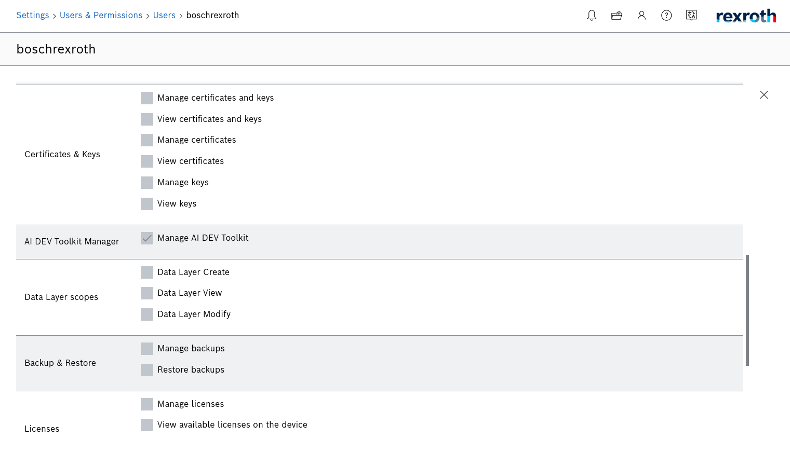

# Basic Functions
The app is made of two main pages, the Jupyter Lab and the Jupyter Manager.
Jupyter Lab is where you can play with your python code, while Jupyter Manager is where you manage the Jupyter server and see your app's logs. 
You can access these pages from the ctrlX Dashboard sidebar as shown in the picture. If you can not see the Jupyter Manager tab, it means that you don't have the full access permission. 


## Start and Stop Jupyter Lab
To start the Jupyter Server, go to the Jupyter Manager page and click on the green Start button under the Manager Jupyter section as shown in the picture. Similarly you can stop the server by clicking the red Stop button.


Once the Jupyter Server is started, you can open Jupyter Lab by clicking on the Open button or from the Sidebar.


## Start and Stop your Python project
You can choose a python file to be executed when the app starts. To do so, place a python file named "app.py" inside a folder named "project", as shown in the following picture. 

You can also Start and Stop your file by using the relevant buttons in the Manage App section of the Jupyter Manager. If you would like to see the logs that your app generates, start the app using the yellow "Start with debug" button. 


## User Management
The User Management is included in the ctrlX Automation Platform. You can manage your users under Settings > Users & Permissions > Users, as shown in the picture below.



## Data persistence
The app's data is stored inside the Active configuration folder. 


## Install more packages
Jupyter AI Toolkit comes with pre-installed python modules that are often used in Data Science and AI, e.g. numpy, matplotlib, scikit-learn, etc.
If you need to install other packages, you can do so by using pip and specifying one of the following target folders: SNAP_DATA, SNAP_COMMON.
If you want your packages to be backup together with the standard ctrlX mechanism, install them in the following folder or subfolder: `/var/snap/rexroth-solutions/common/solutions/DefaultSolution/configurations/appdata/jupyterlab`. 

For example, to install opencv you can run the following command:
```
pip3 install opencv-python -t $SNAP_DATA
```

In your python code, make sure to add $SNAP_DATA to the system paths before importing opencv:
```
import sys
import os
sys.path.append(os.environ['SNAP_DATA'])

import cv2
```

The following packages have been tested...